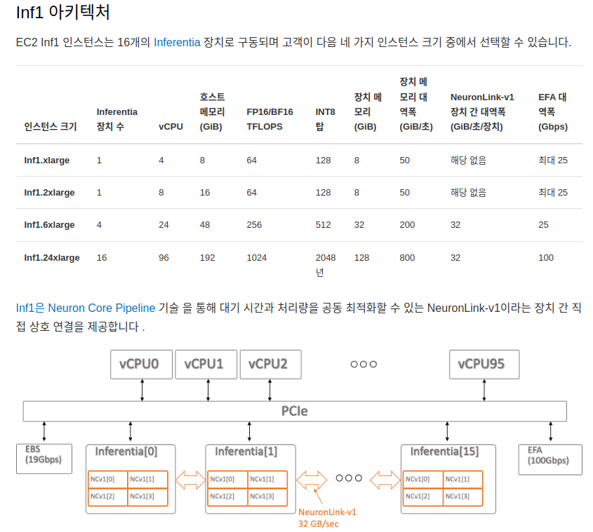

# AWS Neuron SDK Tutorial

----------------
## 1. AWS Neuron SDK에 대한 간단한 개요


AWS ec2 인스턴스 패밀리 'inf(inferntia)'에 관한 설명 및 실습 튜토리얼을 위해 작성하였다. 기본적으로 **inf 인스턴스**는 딥러닝 모델의 추론를 위한 장비라고 생각 하면 된다 (목적은 거의 GPU와 유사하다 - 특정 계산 특화)  
딥러닝 모델 추론을 **반드시 GPU에서 할 필요가 없다**라고 나는 생각한다. 아래 그림은 inf 인스턴스 패밀리의 하드웨어 사양 및 구조이다.

<p align="center">
  
</p>
<p align="center"><a href="https://awsdocs-neuron.readthedocs-hosted.com/en/latest/general/arch/neuron-hardware/inf1-arch.html#aws-inf1-arch"> [ AWS inf 인스턴스 패밀리 ] </a> </p>

<br><br>
예를 들어 **inf1.xlarge**는 CPU 4개, RAM 8기가, 뉴런 칩(neuron chip) 1개를 인스턴스로 구성한다고 보면 된다.
여기서 1개의 뉴런칩은 아래 그림과 같은 구성과 같다
<p align="center">
  
</p>
<p align="center"><a href="https://awsdocs-neuron.readthedocs-hosted.com/en/latest/general/arch/neuron-hardware/inferentia.html#inferentia-arch"> [ AWS neuron chip 구조 ] </a> </p>

위 그림과 같이 구성되어 있고, 하나의 뉴런칩에는 뉴런코어(neuron-core) 4개가 들어 있다.
뉴런 코어의 구성을 보면 SRAM, 텐서 엔진, 벡터 엔진, 스칼라 엔진이 있다.  


<br>

뉴런코어의 구성요소를 간략하게 설명하면 다음과 같다.
 - SRAM : 캐시 메모리와 같이 **빠른 데이터 접근이 필요한 작업**에 사용.
 - ScalarEngine : 출력의 모든 요소가 입력의 한 요소(**예: GELU, SIGMOID 또는 EXP와 같은 비선형성**)에 의존하는 스칼라 계산에 최적화되어 있습니다.
 - VectorEngine :  출력의 모든 요소가 여러 입력 요소에 종속되는 벡터 계산에 최적화되어 있습니다. **예로는 'axpy' 작업(Z=aX+Y), 레이어 정규화, 풀링 작업 등이 있습니다**.
 - TensorEngine : 텐서 계산(**예: GEMM, CONV, Reshape, Transpose**)에 고도로 최적화된 전력 최적화 시스톨릭 어레이를 기반으로 하며 혼합 정밀도 계산(FP16/BF16/INT8 입력, FP32/INT32 출력)을 지원합니다. 각 NeuronCore-v1 TensorEngine은 16TFLOPS의 FP16/BF16 텐서 계산을 제공합니다.
- 하나의 뉴런칩에는 2 GB의 램을 보유한다 (GPU에서 vram이라고 생각하면 된다)  
 

스펙상 뉴런칩 장치 메모리가 8GB라고 명시 되어 있지만, 잘못된?(오해 할만한) 표현인것 같다. 이유는 아래와 같다.
- 2GB 램 * 4개 뉴런코어 = 장치 메모리 **총합 8GB**  


만약, 내 딥러닝 모델의 저장 파일의 크기가 4GB라면? 아무런 처리없이는 뉴런코어에 적재가 불가능 하다. ( 왜냐하면 뉴런코어 하나는 2GB램이 한계다 )
**즉, 큰 딥러닝 모델은 아무런 처리를 하지 않고, 하나의 뉴런코어에 적재가 불가능 하다** (물론 큰 모델을 쪼개거나 뉴런 컴파일 설정하여 여러 뉴런 코어에 분산 그래프 계산을 적용, 큰 모델도 적재가 가능하다) AWS 뉴런 코어를 구성, 컴파일, 테스트를 하려면 많은 공부가 필요하다.  

<br><br>

하지만 내가 inf 인스턴스 (AWS neuron sdk)를 이용해서 딥러닝 서비스 구성하려는 이유는 단 한가지 이다.
- **저렴한 가격**  

<br><br><br>
이 문서를 작성한 현재 기준 인스턴스 가격은 다음과 같다

<p align="center">
  
  
</p>
<p align="center"> [ AWS 서울리젼 인스턴스 가격표, 2023.03.28 - 기준] </p>

|인스턴스 타입|시간당 요금|한달 유지 요금|
|------|---|---|
|g4dn.xlarge|839.01원|604087.2원|
|inf1.xlarge|364.39원|262360.8원|
(현재)환율 1달러 = 1296.77원  

한달동안 딥러닝 모델을 서비스 한다면, GPU기반으로 서비스 했을때는 최소 **60만원**, 뉴런 코어로 했을때는 최소 **26만원**이 소요된다.
그런데 뉴런 칩에는 뉴런코어 4개가 탑재 되는데, inf.xlarge 인스턴스를 사용하면 GPU 4개를 사용하는 효과라고 나는 생각한다. 뉴런 코어 4개에 각기 다른 모델을 적재하여 서비스를 할 수 있다. 저렴해진 가격 덕분에, 구성할 수 있는 시스템에 대해 많은 선택지가 열리게 된다. 

<br>

물론 하나의 GPU(뉴런코어)에도 VRAM(SRAM)이 허락하는한, 여러 딥러닝 모델을 적재할 수 있다. 하나의 GPU에 A,B,C,D모델이 적제 되어 있다고 가정해보자. 물론 구성&환경에 따라 다르겠지만 이런 환경에서 나는 2가지 문제가 있다고 본다.  

1. 서비스(모델 또는 소스코드) 관리가 어렵다
2. 서비스에서 특정 모델 과부하시 다른 모델에도 영향을 준다. 또한 특정 모델을 스케일링 할 수 없다 (통째로 스케일링 된다) 

<br>  

1번은 그냥 통상적으로 생각하는 **통합관리 어려움**이라고 생각 하면 된다.
2번에 문제에 대한 **예시는 아래과 같다.**  
특정 시간 A라는 모델이 과부하가 걸렸다고 가정해보자. A모델 서비스 때문에 다른 B,C,D 모델 서비스도 불안정하게 된다(추론 속도, 에러 등). 또한 이러한 환경구성을 스케일링 하려면 번거롭게 소스코드를 분리하거나, 통째로 복사하여 장비를 추가해야된다. 나는 이러한 문제점들을 해결하기 위해 inf1 인스턴스를 활용하여 MSA(MicroService Architecture)를 구성하였다.  

물론 뉴런 코어 하나가 g4dn의 T4(GPU)만큼 비록 성능을 보여주지 않지만, 클라우드로 서비스를 운영할 때 **유지비**를 생각해 본다면 합리적인 선택이 아닐까 생각한다. 나는 **클라우드를 이용하여 딥러닝 서비스 하는 회사**라면 '반드시 이 기술을 써야한다' 라고 생각한다.


참조
- https://aws.amazon.com/ko/machine-learning/neuron/
- https://awsdocs-neuron.readthedocs-hosted.com/en/latest/


-------------------------
## 2. AWS Neuron SDK 설치 및 설정

### 준비 사항 : AWS 계정


- AWS 뉴런 SDK를 사용하기 위해 환경 설정부터 진행하도록 하겠다. 먼저 다음과 같이 콘솔 검색에 'ec2'를 치고 ec2서비스에 접속한다. **(오른쪽 상단에 AWS지역은 '오하이오'로 하자. 다른 지역보다 싸다)**


<br><br><br>  

### 1) ssh 키 생성  
인스턴스를 생성하고 ssh 접속하기 위해서는 리전별 키를 생성 해줘야 한다. 절차는 다음과 같다
좌측 하단의 메뉴에서 '네트워크 및 보안' > '키 페어' 메뉴를 누르고, 우측 상단의 주황색으로 표시된 **키 페어 생성**을 클릭한다  


<br><br><br>

다음과 같이 생성 창이 뜨고, 키페어 이름만 적고 **키페어 생성**을 누른다.   

<br><br><br>  

생성을 누르면 키페어이름.pem 이라는 파일을 로컬 컴퓨터에 다운 받는다.  
키페어 생성이 완료되고, 키가 등록된 모습은 다음과 같다

<br><br><br>  <br><br><br>  

### 2) AWS EC2 인스턴스 생성

먼저, 실험 하고 싶은 환경에 인스턴스를 생성 한다.

[inf ( AWS neuron ) 인스턴스 생성하는 법](env_file/env_inf1/README.md)


[GPU 인스턴스 생성하는 법](env_file/env_g4dn/README.md)
<br><br><br>  

ec2 인스턴스가 생성 되었다면, Public IP로 접속 할 수 있다.  (아래 그림에서는 52.14.167.251)


<br><br><br>  

ssh 접속은, 생성한 키파일을 이용해서 접속하며, shell 명령어는 다음과 같다

```
ssh -i 키파일경로 접속유저@공인아이피주소
```

``` 
 ## 예시 그림 기준

 ssh -i "test.pem" ubuntu@52.14.167.251

 ## 또는

 ssh -i "test.pem" ubuntu@ec2-52-14-167-251.us-east-2.compute.amazonaws.com
```


<br><br><br>  <br><br><br>  
### 3)  AWS neuron sdk 및 GPU 환경 설정

ec2에 ssh로 접속 하였으면, 실험하고자 하는 인스턴스 종류 따라 다음과 같이 장비 드라이버, python 등을 설치 할 수 있다. 
<br><br><br>  
- inf ( AWS neuron ) 환경 셋팅 
```
git clone https://github.com/kwon-jaehong/aws-neuron-sdk.git
cd ./aws-neuron-sdk
sudo su
source ./env_file/env_inf1/setup.sh
```

<br><br>
- GPU 인스턴스 환경 셋팅
```
git clone https://github.com/kwon-jaehong/aws-neuron-sdk.git
cd ./aws-neuron-sdk
sudo su
source ./env_file/env_g4dn/setup.sh
```

참고:
aws neuron 설치파일 공식 문서

-------------------------------
## 3.  AWS Neuron SDK Tutorial

GPU 환경에서 실험은, 각자 알아서 진행하고 지금부터는 AWS neuron SDK 관련만 진행 한다   


<br><br><br>  

**(선택 사항) 왠만하면 python venv를 생성해서 패키지를 설치하는 것이 심신에 좋을것이다**
```
## 가상환경 생성
python -m venv ./env

## python 가상환경 활성화
source ./env/bin/activate
```

<br><br><br>  

먼저, AWS Neuron SDK를 사용하기 위해 필요한 파이썬 패키지를 설치한다  
```
## aws pip 레포 설정
pip config set global.extra-index-url "https://pip.repos.neuron.amazonaws.com"
## aws neuron, 컴파일러 패키지 설치
pip install "torch-neuron==1.12.1.2.5.8.0" "neuron-cc[tensorflow]" "protobuf==3.20.1" torchvision GoogleDriveDownloader "transformers==4.21.3"
```
<br><br><br>  


**"pytorch_example" 폴더 예제들을 실행 및 코드들을 정독**
<br><br><br>  


## 실험 결과 (**CPU** Vs **GPU Vs** **AWS Neuron** 처리속도)
- **참고로 AWS neuron core 1개만 사용 하였을때 나온 결과이다.**
<br><br>  

|simple_CNN - 모델 파라메터 수 (3백만)|||
|------|---|---|
|**추론 장비**|**추론에 걸리는 시간(1장)**|**1초 처리량**|
|CPU|0.00074초|1337장|
|**AWS neuron**|0.0004초|2310장|
|GPU|0.0006초|1658장|

<br>

|resnet-50 - 모델 파라메터 수 (2천5백만)|||
|------|---|---|
|**추론 장비**|**추론에 걸리는 시간(1장)**|**1초 처리량**|
|CPU|0.069초|14장|
|**AWS neuron**|0.00333초|300장|
|GPU|0.01095초|91장|

<br> 

|bert - 모델 파라메터 수 (1억8백만)|||
|------|---|---|
|**추론 장비**|**추론에 걸리는 시간**|**1초 처리량**|
|CPU|0.069초|14 시퀀스|
|**AWS neuron**|0.00826초|121  시퀀스|
|GPU|0.01494초|67  시퀀스|

<br> 

|craft - 모델 파라메터 수 |||
|------|---|---|
|**추론 장비**|**추론에 걸리는 시간(1장)**|**1초 처리량**|
|CPU|1.1364초|0.87장|
|**AWS neuron**|0.0848초|11장|
|GPU|0.10480초|9.5장|

<br> <br> <br> 


참고:  

- [ AWS 뉴런 example github ](https://github.com/aws-neuron/aws-neuron-samples/tree/master/torch-neuron/inference)


---------------------------


###  코드 리뷰 X 요건 자료 따로 만들자, -> 회사용 소스임
## 애들 소스 정리,구간별 나눠야함

https://www.itworld.co.kr/news/229459
---------------------------


```
python as pt
```


--------------------------


